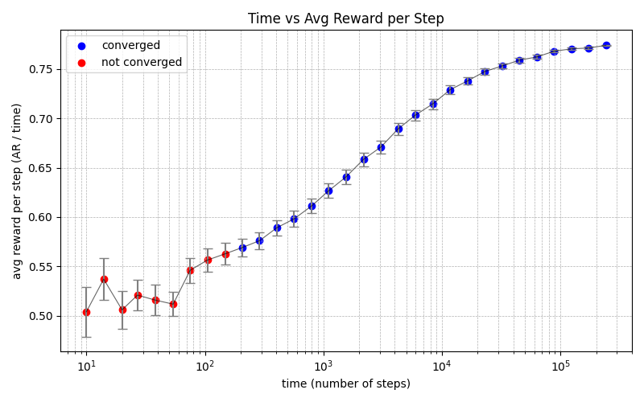

# MultiBandit

このリポジトリは多腕バンディット実験を行うためのスクリプト群を含みます。主なスクリプトと使い方を以下にまとめます。

## 概要
- `Multibandit.py` : 実験のメイン Python スクリプト（平均報酬の計算やプロット出力などを行います）。
- 補助スクリプトは `run_experiment.sh`（ワークフロー用ラッパー）や `experiment_ar.py` にあります。

## 依存関係
- Python 3.x
- numpy
- matplotlib

インストール例（Debian/Ubuntu）:
```fish
python3 -m venv .venv
source .venv/bin/activate
pip install --upgrade pip
pip install numpy matplotlib
```

## 使い方（基本）
リポジトリのルートで以下のように実行すると、K=500 t=6500 epsilon=0.1 （thetaは正規分布(mean:0.5,std:0.1)）でサンプリングし、総報酬を出力します。

```fish
python3 Multibandit.py
```

このプロジェクトには複数の実験ドライバがあるため、実行例をいくつか示します。
オプションは排他的なので何れか一つのみ可能です

### 例: グラフにプロット
Kやepsilonを変更して平均報酬をグラフとして出力したいならexperiment_ar.pyを使用します
--timesオプションでラウンド数をきめることができます
```fish
python3 experiment_ar.py --times 10 100 1000 --fixed-time 1000 --repeats 20 --out ar_single.png
```

### 例: 複数の epsilon を試す
--epsilonsでepsilonの値を指定できます。
```fish
bash run_experiment.sh --epsilons 0.01 0.05 0.1 --fixed-time 6500 --repeats 30 --out ./sample.png
```

### 例: K 列のスイープ
--Ksで腕の数を指定できます
```fish
python3 experiment_ar.py --Ks 10 50 100 --fixed-time 2000 --repeats 10 --out Ks_vs_ar.png
```

### 例: ファイルで オプション を与える（1行ずつ別プロット）
run_experiment.shを指定することでファイルを読み込ませることができます

- 例1：ファイルをthetaやtimesのみの指定に使用する場合
```fish
# theta.txt に各行が1つの theta 設定（カンマ区切り等 ラッパーのフォーマット参照）
# theta.txt
0 0.01 0.02 0.03 0.04
0 0.1 0.2 0.3 0.4

bash programs/shell/run_experiment.sh --theta-file-lines theta.txt --repeats 10 --out theta_{n}.png
```

- 例2：ファイルからthetaとオプションを指定する場合
```fish
# theta.txt に各行が1つの theta 設定 + --repeatsなどのオプション指定（カンマ区切り等 ラッパーのフォーマット参照）
# theta.txt
0 0.01 0.02 0.03 0.04 --repeat 3 --fixed-time 20 
0 0.1 0.2 0.3 0.4 --repeat 10 --fixed-time 30

bash programs/shell/run_experiment.sh --theta-file-lines theta.txt --out theta_{n}.png
```
他にも--times-file-linesや--Ks-file-linesでも同様の処理が可能です
## 出力
- プロット画像（PNG）やログを出力します。`--out` オプションで出力ファイルを指定できます。

### 出力例

下はラッパー実行で得られたプロットの一例です（リポジトリに含まれる `sample.png` を参照）。




## ライセンス
- このプロジェクトは MIT ライセンスの下で公開されています。詳しくは `LICENSE` ファイルを参照してください。
